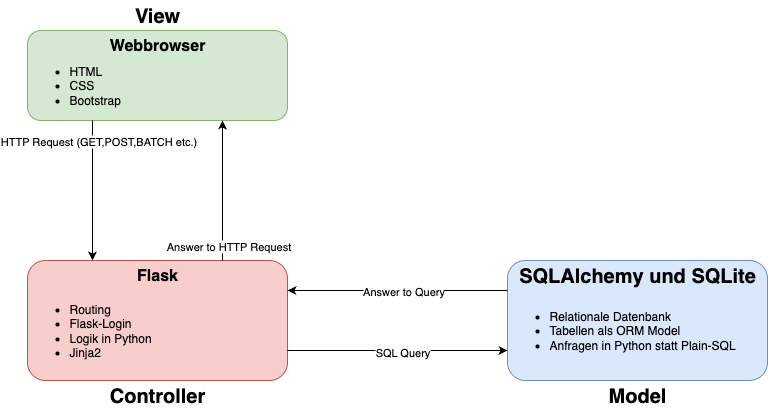
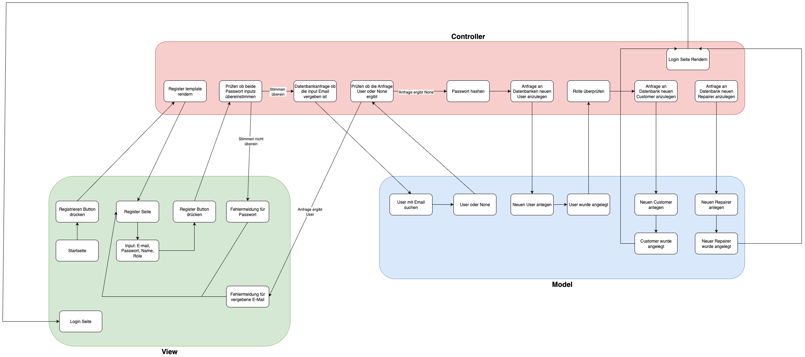

## Überblick

Fix It Togehter ist eine webbasierte Anwendnug um Personen mit deffekten De'Longhi Kaffeemaschine und Personen die diese reparieren können, zu verbinden. Nutzer müssen sich dabei registrieren, um den vollen Umfang der Anwendung benutzen zu können. Dabei sind die Nutzer in zwei Kategorieren unterteilt: Customer und Repairer. Customer können Tickets an Repairer erstellen und eventuell eine Rezension zu fertigen Aufträgen schreiben, und Repairer können die Tickets annehmen oder ablehnen. Eine Chat funktion für Angenommene Tickets ermöglich dabei eine gute Kommunikation, um das Problem der deffekten Kaffemaschine genauer beschreiben zu können.

Die Anwendnug besteht dabei aus einem Flask-Backend, einer SQLAlchemy Datenbank und einem Frontend aus HTML,CSS und Bootstrap und Jinja2. 

## Struktur 

Diese Model-View-Controller Diagramm beschreibt die Architektur der Anwendung: 

### 1. View

· HTML: Grundstrukur für die einzelenen Templates. Beschreibt was dargestellt wird, nicht wie es aussieht.

· CSS: Beschreibt wie einzelen Elemente auf den Templates aussehen. 

· Bootsrap: Frontend Framework um schnell einzelen Teile zu erstellen und designen.

### 2. Controller

· Flask: Web-Basiertes Framework für Python. Flask übernimmt das Routing in der Anwendung, das verarbeiten von HTTP-Anfragen, das rendern der einzelenen Templates und das Einbinden der Datenbank. Damit ist Flask der Kommunikateur zwischen dem Frontend und der Datenbank. 

· Flask-Login: Eine Libary für Flask, um Login-Sessions einfach und sicher zu handeln.

· Jinja2: Ermöglicht die dynmaische Gestatlung von einzelene Templates via Python direkt in HTML.

### 3. Model 

· SQLAlchemy: Datenbank Libary für Python ohne Plain-SQL schreibben zu müssen. 

· SQLite: Speichert Daten der Nutzer, Tickets, Chatnachirchten etc. 

## Logik der Anwendung 

### Authentifizerung 

· User regestrieren sich mit E-Mail, Passwort, Name und Role(Customer oder Repairer)

· Login mit E-Mail und Passwort, Flask-Login speichert die Benutzerdaten in der Session-ID

· Je nach Rolle bekommt man Zugriff auf die Dashboards der jeweilligen Rollen

· Logout erfolgt über den Abmelden Button (Login ist dafür nötig). Flask-Login entfernt die Benuzterdaten aus der Session-ID

### Tickets erstellen 

· Tickets kann nur der Customer erstellen 

· Erfolt über das Dashboard des Customers 

· Step by Step wählt er sein Modell, seine Anfangsnachircht und den Reperateur aus

· Bei der Auswahl des Reperateurs sieht der Customer seinen Namen, Skills, die durchschnittliche Bewertung in Sternen und kann auch die einzelenen Bewertung des spezifischen Reperateueres einsehen 

### Tickets bearbeiten 

· Tickets kann nur der Reperateur bearbeiten 

· Er kann diese Annehmen oder Ablehnen 

· Bei einem angenommen Ticket wird die Chatfunktion aktiviert 

· Nur der Reperateur kann das Ticket abschließen 

