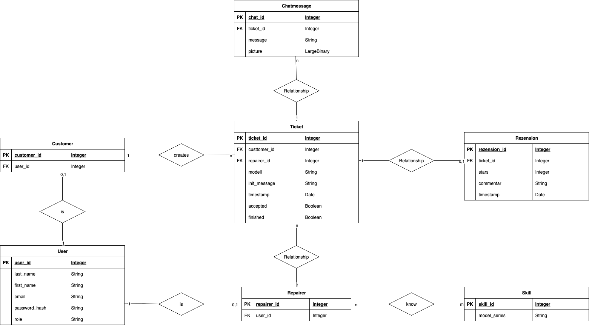

## ER-Modell 

**Hinweis: Das Datenmodell wurde mit dem Tool draw-io erstellt.**

Es gibt User, die entweder Customer oder Repairer sein können. Kunden erstellen Tickets, die auf einen bestimmten Repairer referenzieren. Tickets haben Chatmessages und eventuell eine Rezension. Repairer haben bestimmte Skills.

| Entität | Beschreibung |
| :---: | :---: |
| **User** | Ein User hat eine E-Mail, einen Vor- und Nachnamen, ein Passwort und eine Rolle. Ein User ist entweder ein Customer oder ein Repairer, aber nicht beides gleichzeitig.
|**Customer**| Verweist auf genau einen User. Ein Customer kann mehrer Tickets erstellen.
|**Repairer**| Verweist auf genau einen User. Ein Repairer kann viele Tickets bearbeiten und kann viele Skills haben.
|**Ticket**| Ein Ticket ist die zentrale Tabelle für die Reperaturen. Ein Ticket gehört zu genau einem Customer und einem Repairer. Das Ticket hat die Modellinfo, also um welche De'Longhi Reihe es sich handelt, eine Init-Message, den Timestamp wann das Ticket erstellt wurde, den Status des Tickets sowie ob das Ticket angenommen oder abgelehnt wurde. Dabei hat das Ticket noch Chat-Messages und eventuell eine Rezension, die vom Customer erstellt wird, wenn das Ticket abgeschlossen ist. 
|**Chatmessage**| Jede Chatmessage gehört zu genau einem Ticket, damit der Customer und der Repairer kommunizieren können. Die Chatmessage enthält einen Text, den Timestamp und optional ein Bild. 
|**Rezension**| Eine Rezension ist Optional pro fertigem Ticket. Sie wird vom Customer erstellt. Eine Rezension enthält eine Sternebewertung (1-5), ein Kommentar und das Datum.
|**Skill**| Enthält eine De'Longhi Modellreihe. Ein Repairer kann viele Skills haben, daher ist es eine n zu m Beziehung zwischen Repairer und Skills.  

