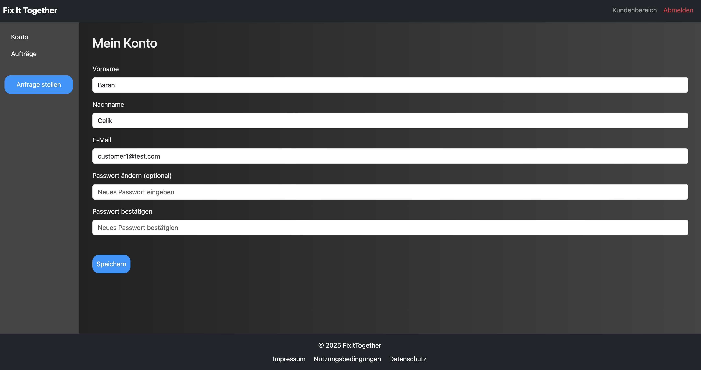
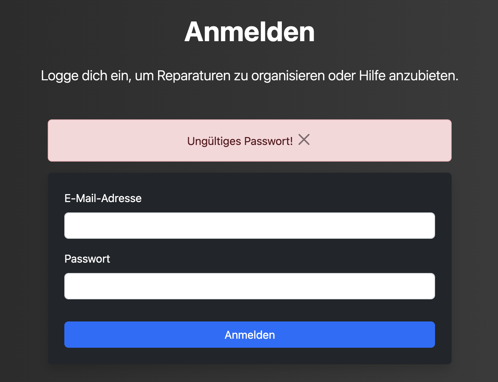
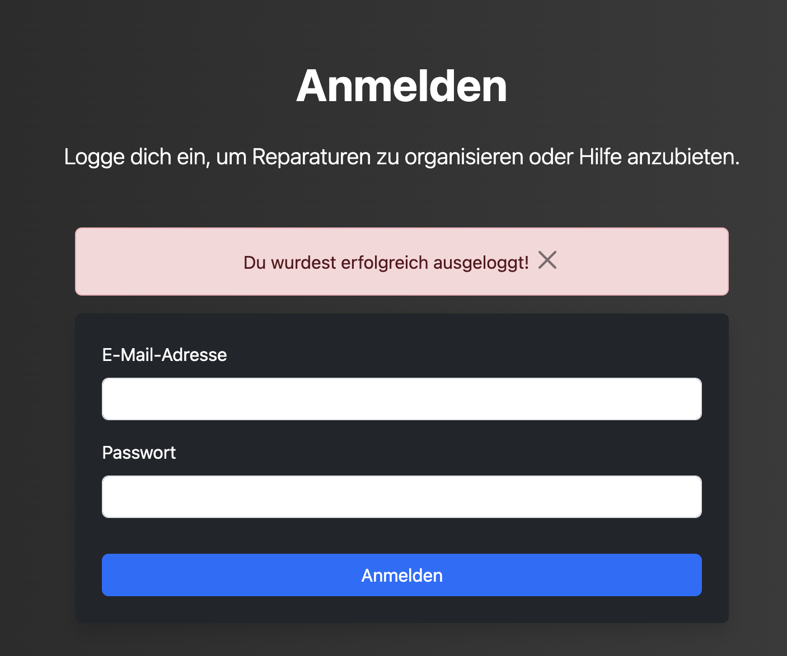

# Authentifizierungs Routen

Authentifizerungs Routen

- [Authentifizierungs Routen](#authentifizierungs-routen)
    - [register()](#register)
    - [login()](#login)
    - [logout()](#logout)

### register()

**Route:** /register

**Methoden:** GET, POST

**Zweck:** Damit kann sich ein neuer User registrieren, um die vollen Funktionen der App nutzen zu können. Dabei ist Wichtig das der User alle Felder ausfüllt, und keine E-Mail benutzt, die bereits vorhanden ist.

**Möglicher Output:**

**Sucess:** 

**Error:**

### login()

**Route:** /login

**Methods:** GET, POST

**Purpose:** Mit dieser Route kann sich der Nutzer einloggen, wenn er bereits ein Bestehenden Account hat. Wenn er sich erfolgreich eingeloggt hat, wird er auf seine Account-Informationsseite weitergeleitet. Gibt er die E-Mail oder das Passwort falsch ein, erscheint eine Fehlermeldung.

**Sample output:** 

**Sucess**

**Error:**

### logout()

**Route:** /logout

**Methods:** GET, POST

**Zweck:** Der User wird von seiner bestehende Session ausgeloggt, und zurück zur Login Seite weitergeleitet.

**Möglicher output:** 

