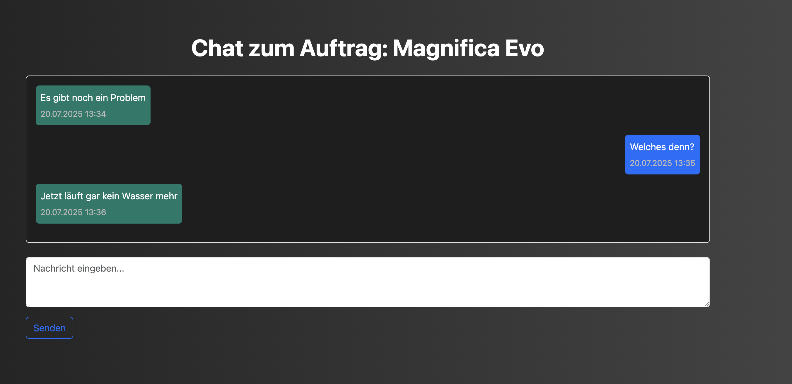
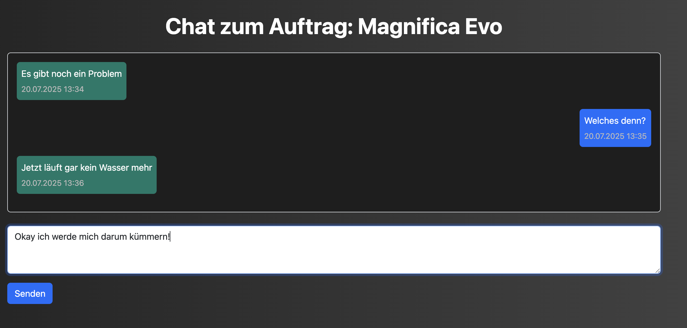
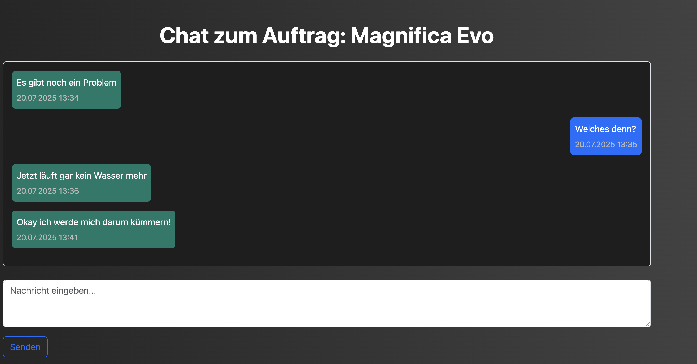

# Chat Routen

Chat Routen

- [Chat Routen](#chat-routen)
    - [open\_chat(ticket\_id)](#open_chatticket_id)
    - [send\_message()](#send_message)

### open_chat(ticket_id)

**Route:** /chat/ticket/int:ticket_id 

**Methods:** GET

**Zweck:** Dieser Route ist dafür, für die jeweillige Ticket id den Chat zu öffnen und diesen einsehen zu können, wenn dort schon Nachirchten ausgetauscht wurden. Diese Route wird vom Customer und Repairer benutzt. Dabei werden die Nachirchten vom Customer links angezeigt und die vom Repairer rechts. 

**Möglicher Output:** 

### send_message()

**Route:** /chat/send

**Methods:** POST 

**Zweck:** Diese Route ist dafür da um in einem Chat, der geöffnet ist, eine beziehungsweise mehrere Nachirchten senden zu können. Dies geschieht über den Button "Senden". 

