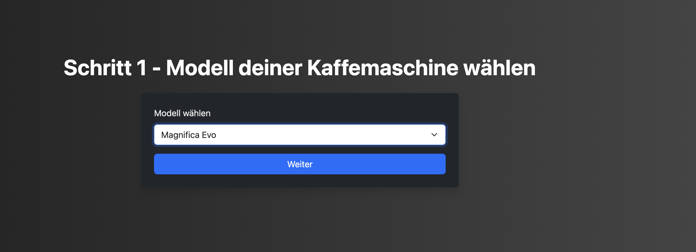
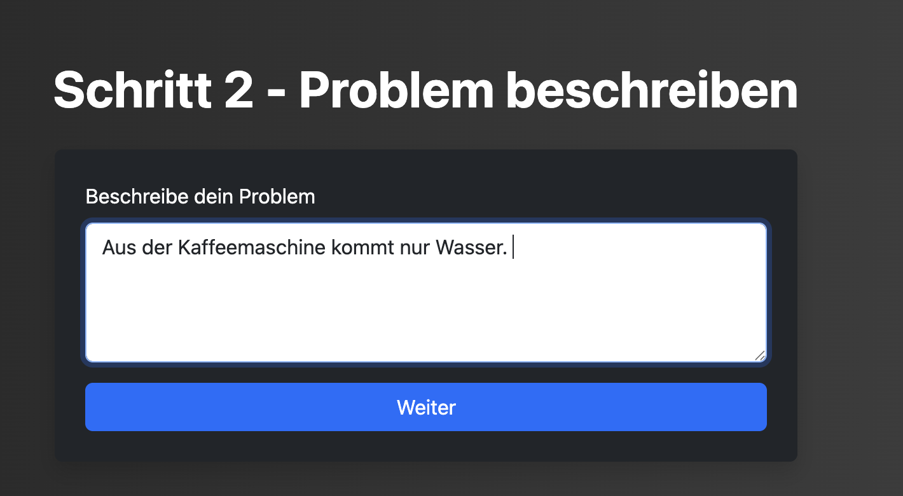
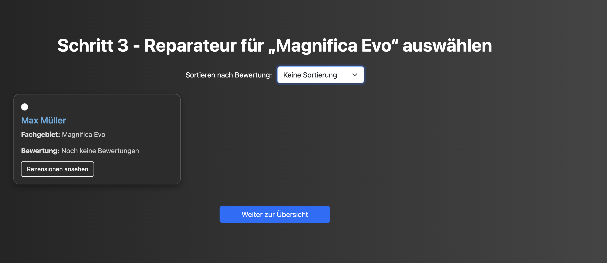
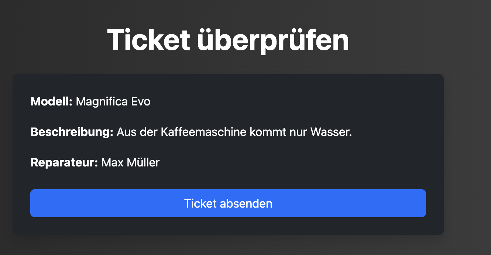
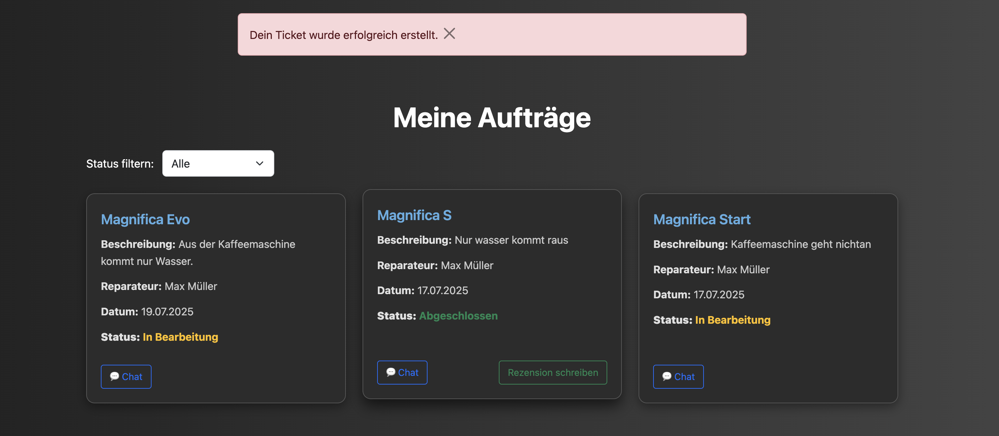
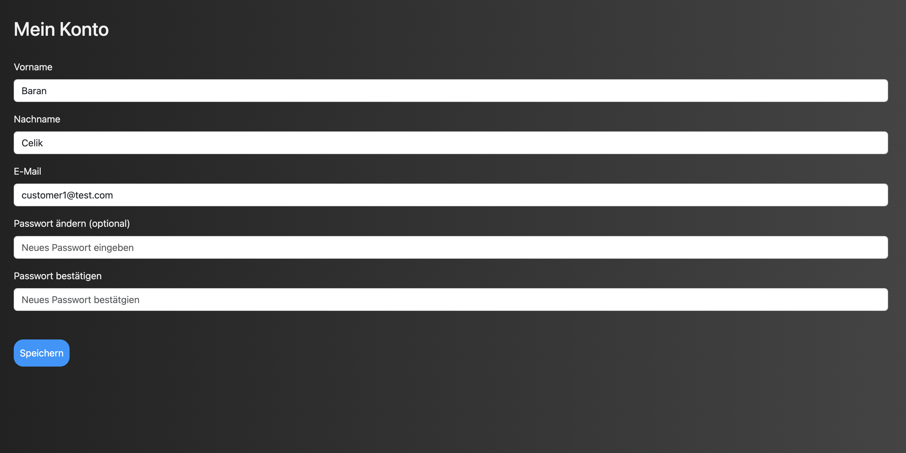
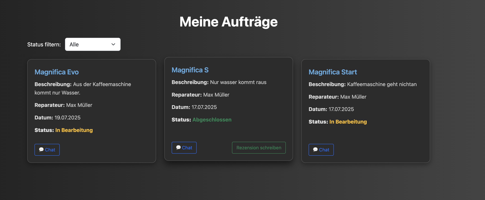

### ticket_step1()

**Route:** /ticket/step1

**Methoden:** GET, POST 

**Zweck:** Wenn der Customer in seiner Sidebar auf neues Ticket erstellen drückt, wird diese Route abgerufen. Hier wählt der Customer zunächst aus, welches Modell von De'Longhi er reparieren lassen möchte.

**Möglicher Output:** 

### ticket_step2()

**Route:** /ticket/step2

**Methoden:** GET, POST 

**Zweck:** Im zweiten Schritt der Ticketerstellung schreibt der Customer eine kurze Nachircht darüber, was an der Kaffeemaschine nicht geht.

**Möglicher output:**

### ticket_step3()

**Route:** /ticket/step3 

**Methode:** GET, POST 

**Zweck:** Im dritten Schritt der Ticketerstellung wählt der Customer den Repairer aus, denn er eine Anfrage schicken möchte. Dabei sieht er in einer Kartenansicht den Namen des Repairers, die Kaffeemaschinenmodelle die er reparieren kann, und seine Bewertungen anhand eines Sternesystems. 

**Möglicher output:**

### ticket_confirmation()

**Route:** /ticket-bestätigung 

**Methoden:** GET, POST 

**Zweck:** Im vierten Schritt kann der Customer komplette Ticket, das er erstellt hat einsehen und dieses dann absenden. Nach dem das Ticket abgesendet wurde wird er auf die Seite weitergeleitet, wo er seine laufenden Anfragen einsehen kann. 

**Möglicher output:** 

**Wichtig:** Die Methoden zu den ganz obigen Routen sind deshalb alle GET und POST, weil wir mit einem Session System gearbeitet haben. Die Daten werden zu dem nächsten Step weitergeleitet, und am Ende bestätigt. 

### get_account_info()

**Route:** /account-information 

**Methods:** GET, POST 

**Zweck:** Diese Route ist das Dashboard des Customers. Hier kann er seine Accountinformationen einsehen und diese auch ändern. 

**Möglicher output:** 

### get_tickets()

**Route:** /get-tickets 

**Methods:** GET

**Zweck:** Diese Route ist dafür da, alle Anfragen und Aufträge des Customers anzuzeigen. Dabei spielt der Status des Tickets keine Rolle. 

**Möglicher output:** 

