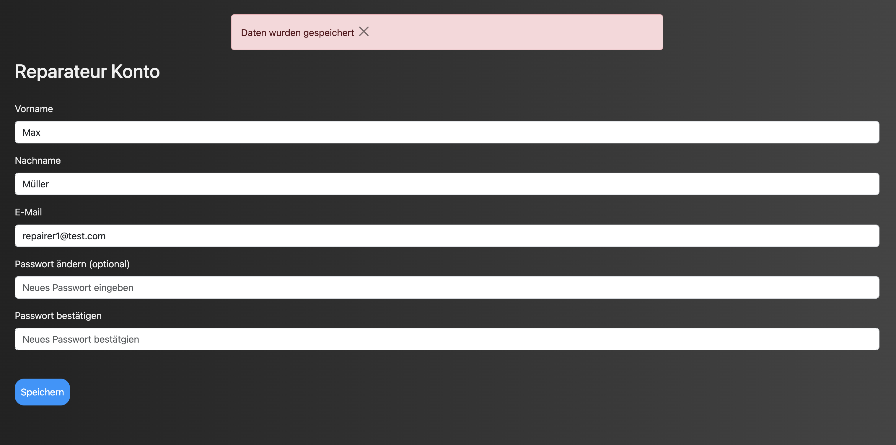
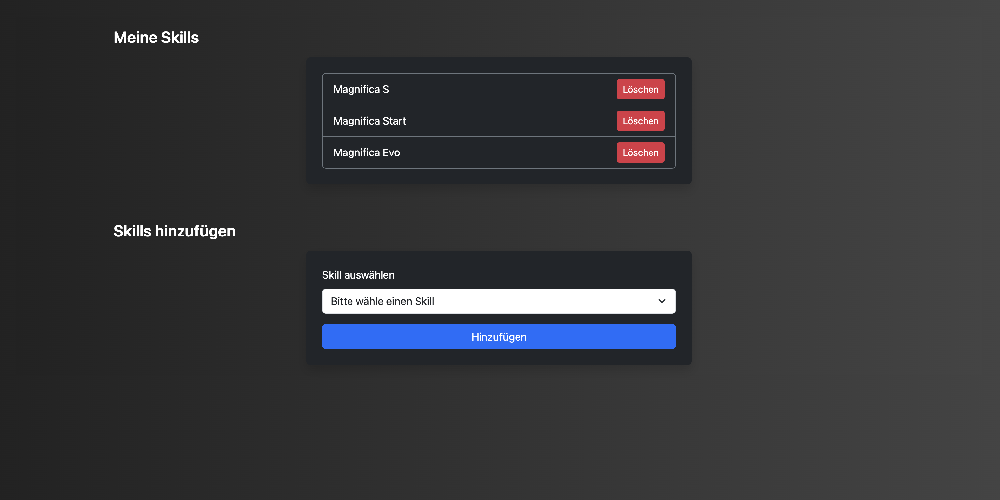
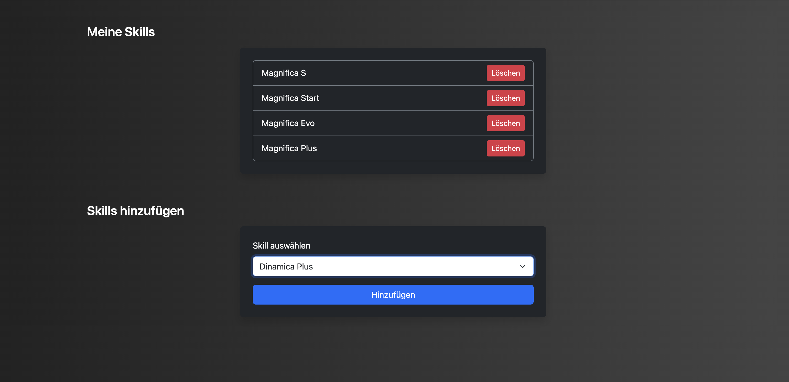
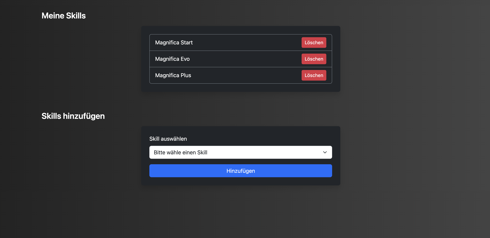
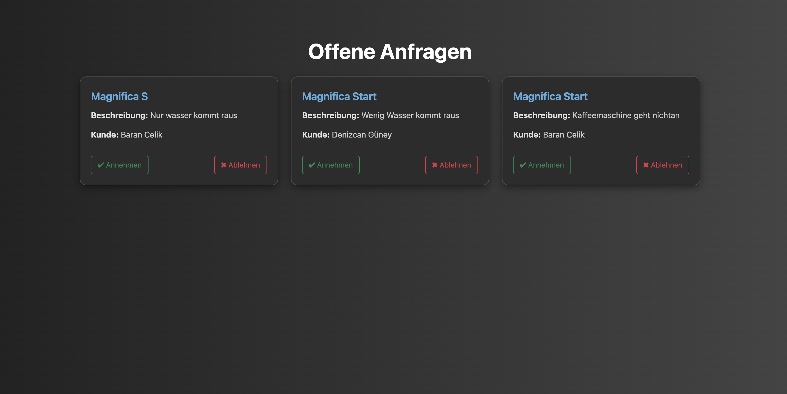
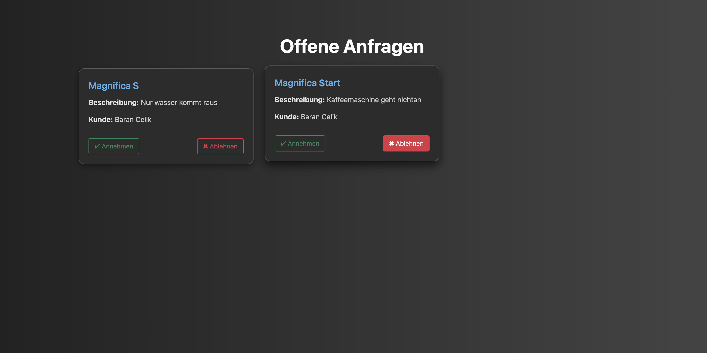
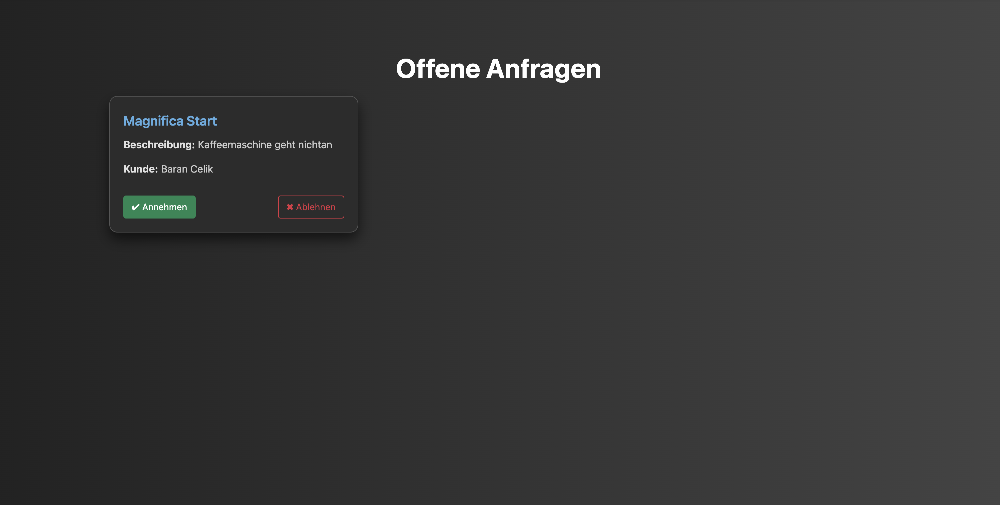
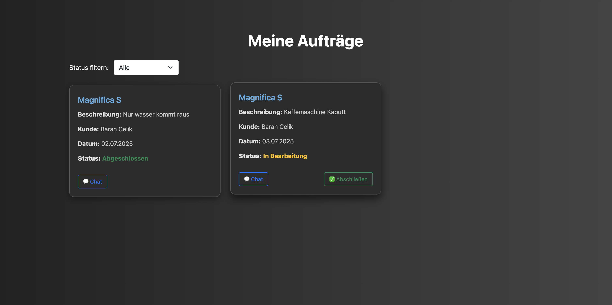
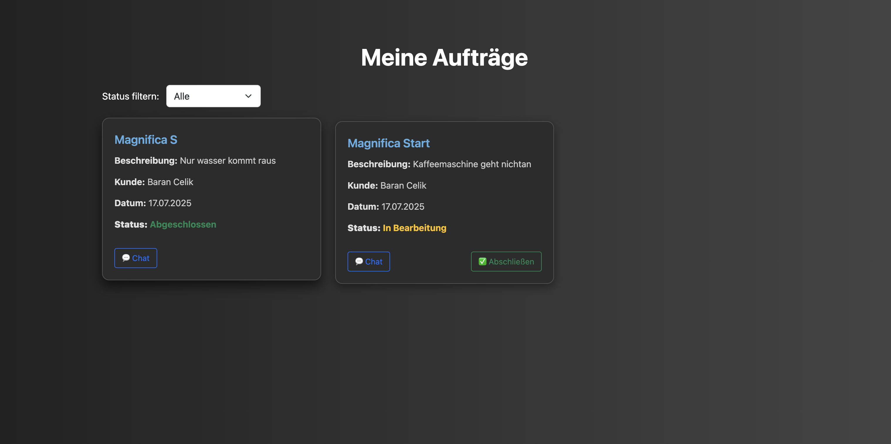

### get_account_info()

**Route:** /accountinformation

**Methods:** GET, POST

**Purpose:** Mit dieser Route wird der Repairer zu der Seite weitergeleitet, wo seine Accountinformationen stehen. Dies kann er immer oben rechts auf der App, bei Reperaturansicht erreichen. Zudem kann er auf der Accountinformationsseite auch seine Daten ändern. 

**Sample output:**

### show_skills()

**Route:** /meine-skills

**Methods:** GET

**Purpose:** Auf dieser Seite sieht der Repairer seine Skills für die einzelnen De'Longhi Kaffeemaschinenreihen, die in der Datebank für sein Konto hinterlegt sind. 

**Sample output:**

### add_skills()

**Route:** /skills-hinzufügen

**Methods:** POST

**Purpose:** Mit einem Button, der auf den jeweilligen Skill referenziert, kann der Repairer diese Skills zu seinem Konto hinzufügen. Damit erscheint er dann in dem Matching. Wenn ein Customer nach diesem Skill filtert. 

**Sample output:** 

### delete_skills()

**Route:** /skills_löschen 

**Methods:** POST 

**Purpose:** Ein Button referenziert auf eine Skill, der in der Datebank für den Repairer hinterlegt ist. Mit diesem Button kann er denn Skill aus seinem Account löschen, falls er ihn versehentlich hinzugefügt hat, oder wenn er keine Lust hat diese Kaffeemaschinereihe grade zu reparieren. 

**Sample output:**

### get_requests()

**Route:** /meine-anfragen

**Methods:** GET 

**Purpose:** Mit dieser Route werden alle Anfrage, die der Repairer erhalten hat, aufgezählt. Dabei sind es reine Anfragen und keine Aufträge. 

**Sample output:** 

### decline_ticket()

**Route:** /ticket-ablehnen 

**Methods:** POST

**Purpose:** Der Button, um das Ticket abzulehnen referenziert auf das Ticket. Damit verschwindet das Ticket von der Anfragen-Ansicht des Repairers. 

**Sample output:**

### accept_ticket()

**Route:** /ticket-annehmen

**Methods:** POST

**Purpose:** Der Button, um das Ticket anzunehmen referenziert auf das Ticket. Wenn der Repairer diesen Button drückt, gilt das Ticket als angenommen und es wird in "Meine Aufträge" gelistet.

**Sample output:** 

### get_tickets()

**Route** /meine-aufträge

**Methods:** GET

**Purpose:** Mit dieser Route werden alle Aufträge, die der Repairere angenommen oder abgeschlossen hat aufgelistet. 

**Sample output:**

### close_ticket()

**Route:** /ticket-abschließen 

**Methods:** POST 

**Purpose:** Dieser Button dient dazu ein Ticket abzuschließen. Wenn der Repairer den Auftrag erledigt hat, drückt er diesen Button. 

**Sample output:**

