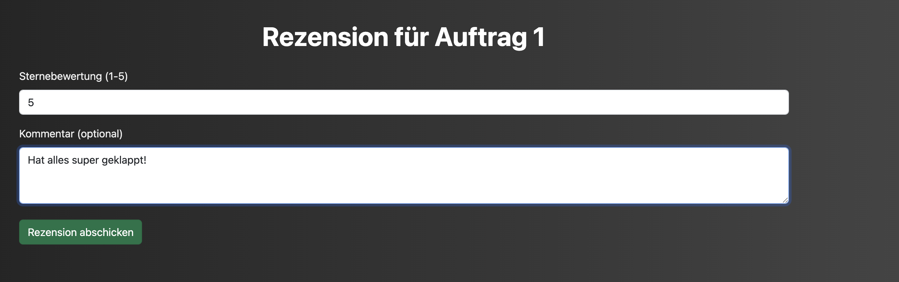
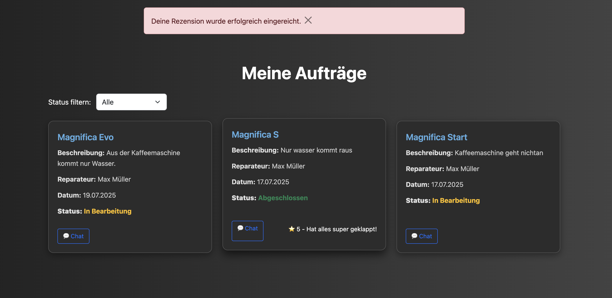
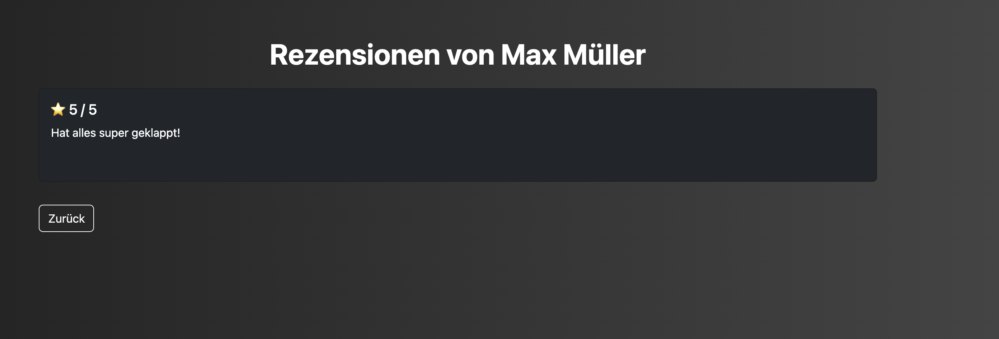

# Review Routen

Review Routen

- [Review Routen](#review-routen)
    - [submit\_review(ticket\_id)](#submit_reviewticket_id)
    - [repairer\_reviews(repairer\_id)](#repairer_reviewsrepairer_id)

### submit_review(ticket_id)

**Route:** /ticket/int:ticket_id/submit_review

**Methods:** GET, POST 

**Zweck:** Wenn ein Ticket abgeschlossen ist, kann der Customer auf den Review Button drücken. Dort kann er seine Bewertung für den Auftrage schreiben und diese absenden, die dann in der Datebank gespeichert wird. 

**Möglicher Output:** 

 
 

 ### repairer_reviews(repairer_id)

 **Route:** /repairer/int:repairer_id/reviews

 **Methods:** GET, POST 

 **Zweck:** Wenn der Customer ein Ticket erstellt und zu dem Step kommt, wo er sich einen Repairer aussuchen kann, kann er die Bewertungen einsehen, die für diesen Repairer in der Datenbank hinterlegt sind. Anhand dessen kann er dann gezielter auswählen, ob er seine Kaffeemaschine bei diesen Repairer reparieren lassen möchte. 

 **Möglicher output:** 

 