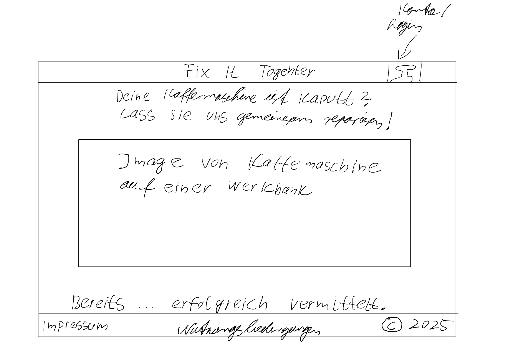
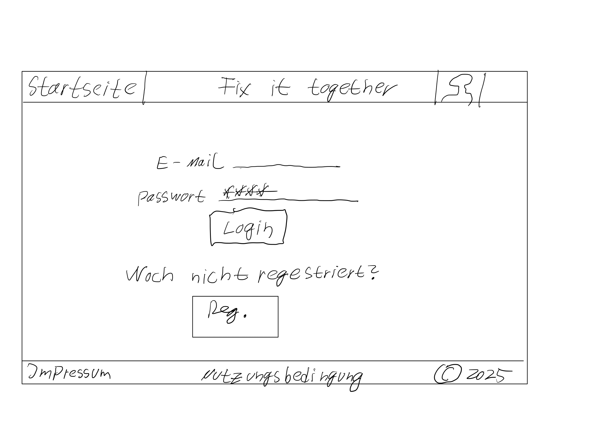
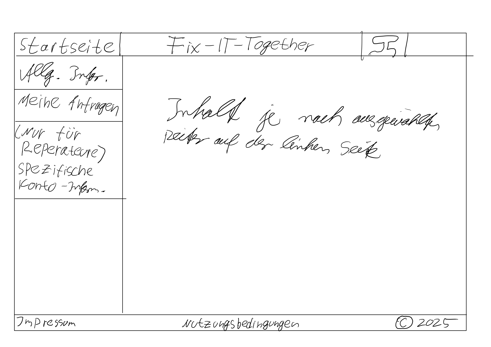
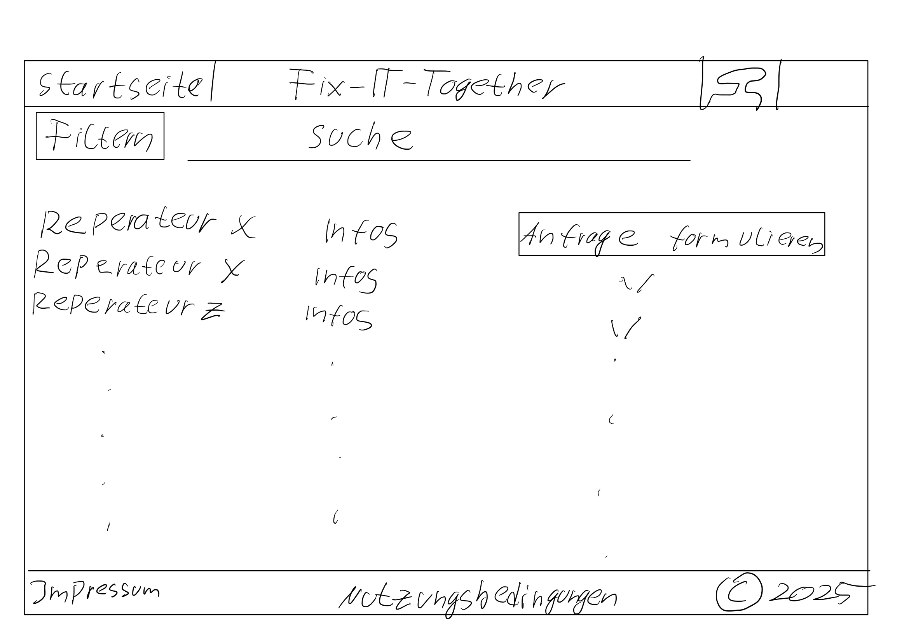
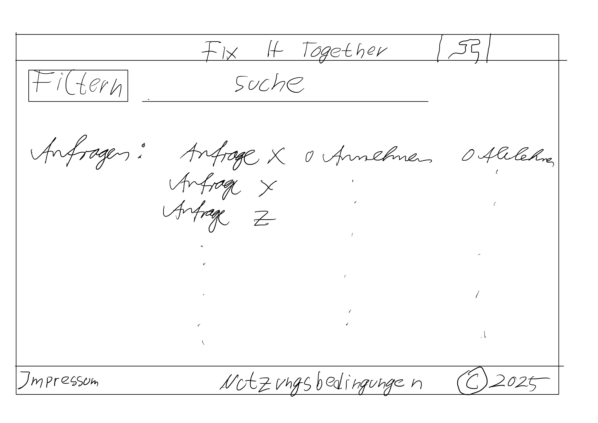

Stand jetzt: Wir haben uns überlegt dass wir 6 UI Screens brauchen, damit der Customer und der
Repairer ein angenemmes Erlebnis auf unsere Website haben. Die Screens sind so gestaltet, dass man leicht versteht, welche Funktion welcher Button zum beispiel hat.

Wichtig: Die Screens sind noch nicht final und dienen als Orientierung. Eventuell kommen noch mehr Screens hinzu. Nachträgliche Ergänzung werden in der Dokumentation versehen. 

## 1. Starteite

## 2. Login
   

## 3. Register

   
## 4. Konto

   
## 5. Customer

   
## 6. Anfragen Repairer 

