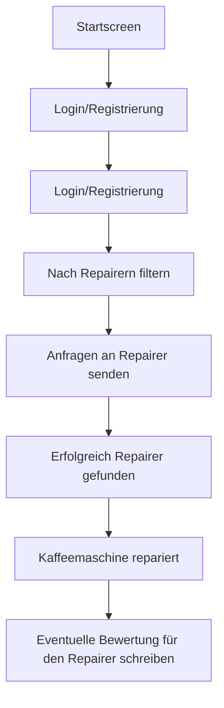

## Problem 

Viele Produkte, unter anderem auch Kaffeemaschinen werden heutzutage so gebaut, dass sie schneller kaputtgehen. Dabei sind die meisten Defekte nur kleinere Sachen wie Verkalkung, Verstopfung oder eine defekte Wasserpumpe. Diese Mängel können leicht behoben werden, wenn man das nötige Know-how dazu hat. Doch viele Personen trauen es sich nicht zu, es einfach mal selbst zu versuchen. Die Reparaturpreise von den Herstellern sind dabei so hoch angesetzt, dass es nicht wirtschaftlich ist, diese direkt beim Hersteller reparieren zu lassen. Zudem dauert eine Reperatur beim Hersteller auch viel zu lange. Kaffeetrinker können nicht 1-3 Wochen warten, bis ihre liebe Kaffeemaschine wieder zuhause ist. Die meisten kaufen sich dann eine neue Kaffeemaschine, was widerum auch nicht gut für die Umwelt ist.

## Unsere Lösung

Die Lösung für das oben beschriebene Problem ist eine Plattformbasierte Website, in der Personen, die eine kaputte Kaffeemaschine von De'Longhi haben, sich mit Personen connecten können, die diese Reparieren können. Dabei wird nach Modellserie gefiltert, da sich Kaffeemaschinen einer gleichen Modellserie im Aufbau sehr änhlich sind. Kunden können nach dieser Modellserie filtern, und bekommen angezeigt, wer diese Reparieren kann. Dabei geht es nur um die Kontaktaufnahme. Bezahlung oder anderes werden unter den beiden Parteien geklärt, ähnlich wie das frühere Ebay-Kleinanzeigen.

## Warum grade De'Longhi?

De'Longhi Kaffeemaschinen sind im Preis etwas höher angesetzt. Würde man jetzt Kaffeemaschinen reparieren die im Schnitt 50-60 Euro kosten, würde sich das auch auf Fix It Together wirtschaftlich nicht lohnen. Zudem sind De'Longhi Kaffeemaschinen in Deutschland weit verbreitet, grade wegen ihrer guten Qulität. 

## Benutzergruppen

### Kunde

· Name: Sabine

· Alter: 45

· Beruf: Einzelhandelskauffrau

· Technikaffinität: Niedrig

· Umweltbewusstsein: Hoch

· Hat eine kaputte Kaffeemaschine von De Longhi

#### Ziele:

· Möchte ihre kaputte Kaffeemaschine nicht wegschmeißen, weil sie nachhaltig denkt.

· Sie sucht eine unkomplizierte und schnelle Lösung.

#### Hindernisse:

· Durch ihre geringe Technikaffinität, traut sie sich nicht selbst den Versuch zu wagen, die Kaffeemaschine zu reparieren.

· Die Garantie der Kaffeemaschine ist schon abgelaufen.

· Die Reparatur direkt beim Hersteller ist ihr viel zu teuer.

#### Lösung:

· Findet Fix It Together über Google oder eine Empfehlung.

· Findet schnell eine Person, der ihre defekte Kaffeemaschine zu ihrem Wunschpreis reparieren kann.

### Reperateur

· Name: Thomas

· Alter: 35

· Beruf: Elektriker

· Technikaffinität: Sehr hoch

· Umweltbewusstsein: Mittel

· Hat über Jahre gelernt wie man Kaffeemaschine von De Longhi repariert

#### Ziele:

· Möchte sich nebenbei durch seine Fertigkeiten in Bezug auf die Reparatur von Kaffeemaschine nebenbei etwas dazuverdienen.

#### Hindernisse:

· Sehr begrenzte Reichweite. Eigene Werbung ist ihm zu teuer.

· Benötigt vorab Informationen über die Probleme wie zum Beispiel Bilder, um einschätzen zu können, ob er die Kaffeemaschine reparieren kann.

#### Lösung:

· Findet Fix It Togehter über Google oder Empfehlungen.

· Prüft regelmäßig Anfragen auf Fix It Together.

· Baut sich ein gutes Nebeneinkommen auf.

## Customer Journey

