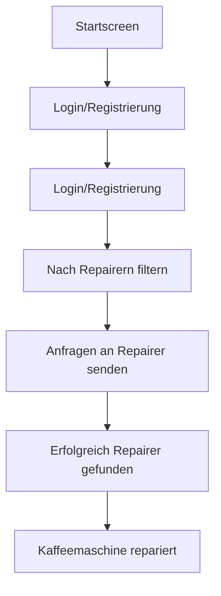

## Value Propostion 
Viele Produkte, unter anderem auch Kaffeemaschinen werden heutzutage so gebaut, dass sie schneller kaputtgehen. Dabei sind meisten Defekte nur kleinere Sachen wie Verkalkung, Verstopfung oder eine defekte Wasserpumpe. Diese Mängel können leicht behoben werden, wenn man das nötige Know-how dazu hat. Doch viele Personen trauen es sich nicht zu, es einfach mal selbst zu versuchen. Die Reparaturpreise von den Herstellern sind dabei so hoch angesetzt, dass es nicht wirtschaftlich ist, diese direkt beim Hersteller reparieren zu lassen. Viele Leute kaufen sich dann einfach eine neue Kaffeemaschine und die alte wird weggeschmissen, was wiederum auch nicht nachhaltig ist.

## Our solution

Die Lösung für das oben beschriebene Problem ist eine Plattformbasierte Website, in der Personen, die eine kaputte Kaffeemaschine haben, und Personen, die das nötige Know-how dazuhaben um diese reparieren zu können, agieren. Beide Parteien registrieren sich auf der Website und die Personen mit den Kaputten Kaffeemaschine stellen Anfragen an die Personen, die Kaffeemaschinen reparieren können. Dabei geht es nur um die Kontaktaufnahme. Ob der Reparateur Geld verlangt oder nicht wird unter den beiden Parteien geklärt. Die Website dient nur als Vermittlung.

## Target user

### Customer

· Name: Sabine

· Alter: 45

· Beruf: Einzelhandelskauffrau

· Technikaffinität: Niedrig

· Umweltbewusstsein: Hoch

· Hat eine kaputte Kaffeemaschine

#### Ziele:

· Möchte ihre kaputte Kaffeemaschine nicht wegschmeißen, weil sie nachhaltig denkt.

· Sie sucht eine unkomplizierte und schnelle Lösung.

#### Hindernisse:

· Durch ihre geringe Technikaffinität, traut sie sich nicht selbst den Versuch zu wagen, die Kaffeemaschine zu reparieren.

· Die Garantie der Kaffeemaschine ist schon abgelaufen.

· Die Reparatur direkt beim Hersteller ist ihr viel zu teuer.

#### Lösung:

· Findet Fix It Together über Google oder eine Empfehlung.

· Findet schnell eine Person, der ihre defekte Kaffeemaschine zu ihrem Wunschpreis reparieren kann.

### Repairer

· Name: Thomas

· Alter: 35

· Beruf: Elektriker

· Technikaffinität: Sehr hoch

· Umweltbewusstsein: Mittel

· Hat über Jahre gelernt wie man Kaffeemaschine von einer Firma repariert.

#### Ziele:

· Möchte sich nebenbei durch seine Fertigkeiten in Bezug auf die Reparatur von Kaffeemaschine nebenbei etwas dazuverdienen.

#### Hindernisse:

· Sehr begrenzte Reichweite. Eigene Werbung ist ihm zu teuer.

· Benötigt vorab Informationen über die Probleme wie zum Beispiel Bilder, um einschätzen zu können, ob er die Kaffeemaschine reparieren kann.

#### Lösung:

· Findet Fix It Togehter über Google oder Empfehlungen.

· Prüft regelmäßig Anfragen auf Fix It Together.

· Baut sich ein gutes Nebeneinkommen auf.

## Customer Journey

