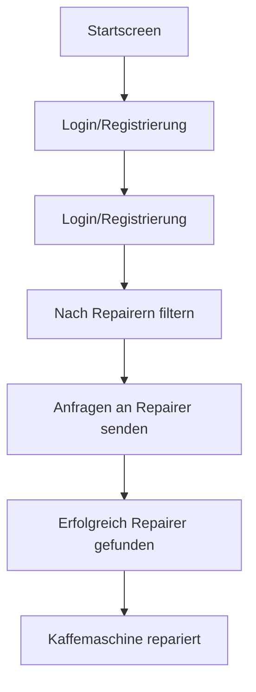

## Value Propostion 

Viele Produkte, unteranderem auch Kaffeemaschinen werden heutzutage so gebaut, dass sie schneller kaputt gehen. Dabei sind meisten Deffekte nur kleinere Sachen wie Verkalkung, Verstopfung oder eine deffekte Wasserpumpe. Diese Mängle können leicht behoben werden, wenn man das nötige Know-How dazu hat. Doch viele Personen trauen es sich nicht zu, es einfach mal selbst zu versuchen. Die Reperaturpreise von den Herstellern sind dabei so hoch angesetzt, dass es nicht wirtschaftlich ist, diese direkt beim Hersteller reparieren zu lassen. Viele Leute kaufen sich dann einfach eine neue Kaffeemaschine und die alte wird weggeschmießen, was widerum auch nicht Nachhaltig ist.

## Our solution

Die Lösung für das oben beschriebene Problem ist eine Platformbasierte Website, in der Personen, die eine kaputte Kaffeemaschine haben, und Personen die das nötige Know-How dazuhaben um diese reparieren zu können, agieren. Beide Partein regestrieren sich auf der Website und die Personen mit den Kaputten Kaffemaschine stellen Anfragen an die Personen, die Kaffemaschinen reparieren können. Dabei geht es nur um die Kontaktaufnahme. Ob der Reperateur geld verlangt oder nicht wird unter den beiden Partein geklärt. Die Website dient nur als Vermittlung.

## Target user 

### Customer

· Name: Sabine

· Alter: 45

· Beruf: Einzelhandelskauffrau 

· Technikaffinität: Niedrig

· Umweltbewusstsein: Hoch 

· Hat eine kaputte Kaffeemaschine

#### Ziele:

· Möchte ihre kaputte Kaffemaschine nicht wegschmeißen, weil sie nachhaltig denkt.

· Sie sucht eine unkomplizierte und schnelle Lösung.

#### Hindernisse:

· Durch ihre geringe technikaffinität, traut sie sich nicht selbst den Versuch zu wagen, die Kaffeemaschine zu reparieren.

· Die Garantie der Kaffeemaschine ist schon abgelaufen.

· Die Reperature direkt beim Hersteller ist ihr viel zu teuer. 

#### Lösung: 

· Findet Fix It Together über Google oder eine Empfehlung. 

· Findet schnell eine Person, der ihre deffekte Kaffeemaschine zu ihrem Wunschpreis reparieren kann.

### Repairer

· Name: Thomas 

· Alter: 35 

· Beruf: Elektriker

· Technikaffinität: Sehr hoch 

· Umweltbewusstsein: Mittel 

· Hat über Jahre gelernt wie man Kaffeemaschine von einer Firma repariert.

#### Ziele: 

· Möchte sich nebenbei durch seine Fertigkeiten im bezug auf die Reperatur von Kaffemaschine nebenbei etwas dazu verdienen.

#### Hindernisse:

· Sehr begrenzte Reichweite. Eigene Werbung ist ihm zu teuer. 

· Benötigt vorab Informationen über die Probleme wie zum Beispiel Bilder, um einschätzen zu können ob er die Kaffemaschine reparieren kann. 

#### Lösung: 

· Findet Fix It Togehter über Google oder Empfehlungen.

· Prüft regelmäßig Anfragen auf Fix It Together. 

· Baut sich ein gutes Nebeneinkommen auf.

## Customer Journey

